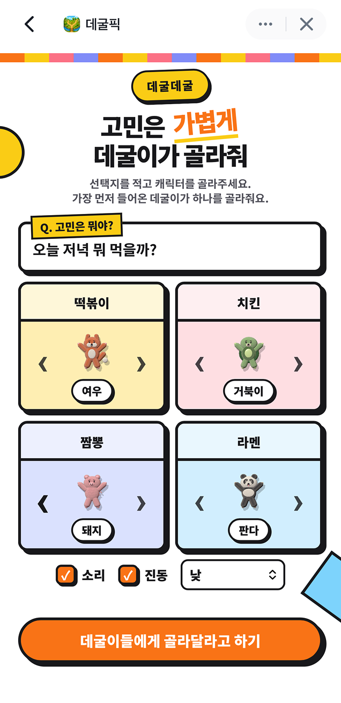
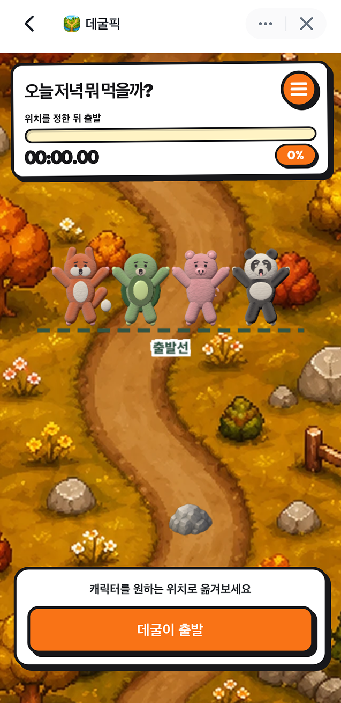
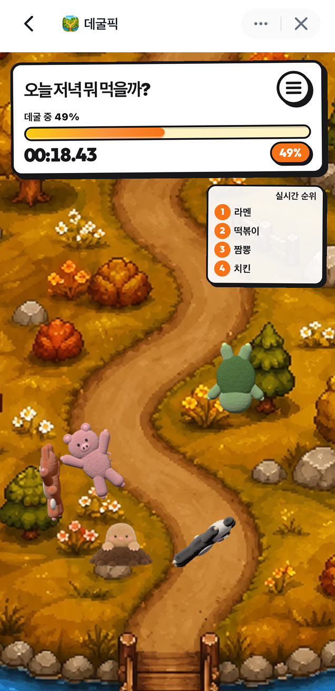
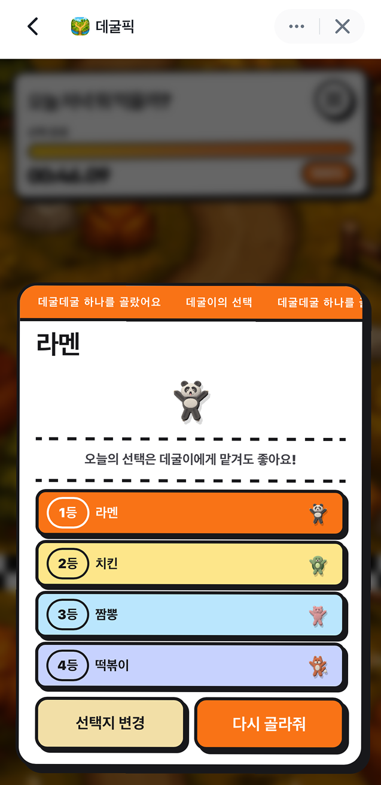

# 데굴픽 (Rollie Picks)

선택지를 캐릭터에게 맡기고, 가장 먼저 결승선에 도착한 데굴이로 답을 정하는 모바일 선택 게임입니다.

고민과 2~4개의 선택지를 입력하고 캐릭터를 고른 뒤 출발 위치를 배치하면, 봉제 인형처럼 구르는 캐릭터들이 물리 기반 코스를 달립니다. 즉시 결과만 보여주는 추첨 대신 순위가 바뀌는 과정을 함께 즐기는 앱인토스 WebView용 경험입니다.

## 화면

| 선택지 설정 | 출발 위치 배치 |
| --- | --- |
|  |  |

| 레이스 진행 | 결과 확인 |
| --- | --- |
|  |  |

## 핵심 흐름

1. 고민 제목과 필수 선택지 2개, 선택 선택지 최대 2개를 입력합니다.
2. 중복되지 않는 캐릭터를 선택하고 소리·진동·낮/밤 배경을 설정합니다.
3. 캐릭터의 시작 위치를 직접 옮긴 뒤 레이스를 시작합니다.
4. 진행률, 시간, 실시간 순위를 보며 레이스를 관전합니다.
5. 우승 선택지와 전체 순위를 확인하고 같은 선택지로 다시 하거나 내용을 수정합니다.

## 구현 상태

| 기능 | 상태 | 설명 |
| --- | --- | --- |
| 고민과 2~4개 선택지 입력 | 구현 완료 | 고민 20자, 선택지별 12자로 제한하며 앞의 두 선택지는 필수입니다. |
| 캐릭터 선택 | 구현 완료 | 곰·토끼·고양이·오리 등 10종 중 활성 선택지끼리 중복되지 않게 고릅니다. |
| 출발 위치 배치 | 구현 완료 | 포인터 입력으로 캐릭터를 옮기며 겹치면 가까운 빈 위치로 보정합니다. |
| 물리 기반 레이스 | 구현 완료 | Three.js와 Rapier로 회전·부착·충돌을 처리하고 장애물과 추격 보정을 적용합니다. |
| 진행 상황과 결과 | 구현 완료 | 타이머, 진행률, 실시간 순위, 우승 선택지와 전체 순위를 표시합니다. |
| 소리·진동·테마 | 구현 완료 | 효과음/배경음, 앱인토스 햅틱과 브라우저 진동 대체, 낮·밤·자동 테마를 제공합니다. |
| 설정 저장 | 구현 완료 | 소리·진동·테마를 앱인토스 `Storage`에 저장합니다. |
| 결과 이미지 저장·공유 | 미구현 | 현재 결과 화면에는 선택지 변경과 다시 골라주기만 있습니다. |
| 로그인·서버 동기화 | 미구현 | 인증, 데이터베이스, 애플리케이션 API가 없습니다. |

상세 정상·예외 흐름과 근거는 [기능 명세](docs/functional-specification.md)에서 확인할 수 있습니다.

## 기술 스택

- React 19, TypeScript 7, Vite 8
- Three.js: WebGL 장면과 캐릭터 렌더링
- Rapier 3D: 중력, 충돌, 관절 기반 레이스 물리
- GSAP: 캐릭터 배치 보정 애니메이션
- Apps in Toss Web Framework와 TDS Mobile: WebView 설정, 기기 기능, UI 컴포넌트

## 빠른 시작

Vite 8의 요구사항에 맞춰 Node.js `20.19+` 또는 `22.12+`가 필요합니다. 이 저장소는 `package-lock.json`을 사용합니다.

```bash
git clone https://github.com/toss-aug-hackathon/rollie-picks.git
cd rollie-picks
npm ci
npm run dev:web
```

브라우저에서 터미널에 표시된 주소로 접속합니다. 기본 Vite 포트는 `5173`입니다.

앱인토스 개발 환경은 다음 명령으로 실행합니다.

```bash
npm run dev
```

`granite.config.ts`는 기본적으로 사용 가능한 로컬 IPv4 주소를 개발 호스트로 선택합니다. 특정 주소가 필요하면 실행 시에만 `AIT_DEV_HOST`를 지정할 수 있습니다.

```bash
AIT_DEV_HOST=127.0.0.1 npm run dev
```

별도의 필수 환경 변수나 `.env` 파일은 없습니다.

## 명령

| 명령 | 역할 |
| --- | --- |
| `npm run dev` | Granite 앱인토스 개발 서버 실행 |
| `npm run dev:web` | Vite 웹 개발 서버 실행 |
| `npm run build` | 웹 프로덕션 빌드 |
| `npm test` | 현재 구성된 검증 명령으로 웹 빌드 실행 |
| `npm run preview` | 빌드 결과 로컬 미리보기 |
| `npm run build:ait` | 웹 빌드 후 앱인토스 번들 생성 |
| `npm run deploy` | 앱인토스 배포 실행 |

`deploy`는 외부 배포 상태를 변경하므로 필요한 계정과 권한을 확인한 뒤 실행해야 합니다.

## 구조

```text
src/
├── App.tsx                 # 화면 상태와 게임 흐름 조정
├── components/             # 설정, HUD, 게임 캔버스, 메뉴, 결과 UI
├── game/
│   ├── engine.ts           # Three.js·Rapier 게임 엔진
│   └── course.ts           # 코스 장면과 테마 텍스처
├── assets/                 # 배경, 장애물, 결과 캐릭터 이미지
└── utils/feedback.ts       # 햅틱과 브라우저 진동 대체
```

## 문서

- [기능 명세](docs/functional-specification.md): 사용자 기능, 정상·예외 흐름, 구현 상태
- [정보구조](docs/information-architecture.md): 단일 화면 앱의 상태별 화면과 전환
- [아키텍처](docs/architecture.md): React UI, 게임 엔진, 기기 기능과 데이터 흐름

데이터베이스와 호출 가능한 HTTP/RPC/GraphQL API는 구현되어 있지 않아 ERD와 API 명세는 생성하지 않았습니다.

## 검증과 제한

- 자동화된 단위·통합·E2E 테스트는 없습니다. `npm test`는 `npm run build`와 동일합니다.
- 린트 스크립트와 린트 설정은 없습니다.
- 프로덕션 빌드는 성공하지만 메인 JavaScript 청크가 500 kB를 초과한다는 Vite 경고가 발생합니다.
- 앱인토스 기기 API와 실제 WebView 동작, 햅틱은 브라우저 빌드만으로 검증할 수 없습니다.
- 라이선스 파일이 없어 재사용 조건은 확인이 필요합니다.
