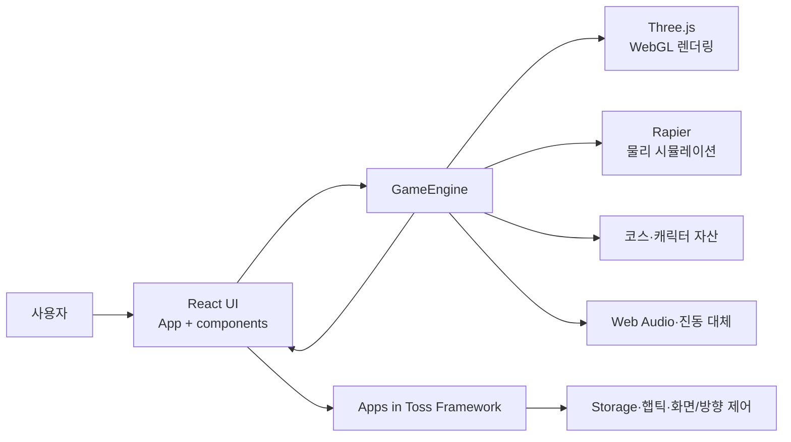

# 아키텍처

[README로 돌아가기](../README.md) · [기능 명세](functional-specification.md) · [정보구조](information-architecture.md)

## 시스템 범위

데굴픽은 앱인토스 파트너 WebView와 일반 브라우저에서 실행되는 정적 단일 페이지 애플리케이션입니다. React가 사용자 입력과 화면 상태를 관리하고, 하나의 `GameEngine` 인스턴스가 Three.js 렌더링·Rapier 물리·오디오·레이스 규칙을 담당합니다. 자체 서버, 데이터베이스, 작업 큐는 없습니다.

화살표는 런타임 호출 또는 상태 전달 방향을 뜻합니다.

## 컴포넌트 책임

| 영역 | 책임 | 입력 | 출력·외부 효과 | 근거 |
| --- | --- | --- | --- | --- |
| 진입점 | TDS 제공자 구성과 플랫폼 표시 | 브라우저 user agent | React 앱 마운트 | [`src/main.tsx`](../src/main.tsx) |
| `App` | 화면 상태, 설정, 엔진 콜백 조정 | 사용자 입력, 엔진 이벤트 | 화면 전환, Storage 읽기/쓰기, 기기 설정 | [`src/App.tsx`](../src/App.tsx) |
| UI 컴포넌트 | 설정·HUD·메뉴·결과 표현 | React props와 이벤트 | 사용자 액션 콜백 | [`src/components`](../src/components) |
| `GameCanvas` | 캔버스 생명주기와 엔진 연결 | 참가자·설정 props | 엔진 생성/파괴, 상태 콜백 | [`GameCanvas.tsx`](../src/components/GameCanvas.tsx) |
| `GameEngine` | 레이스 규칙과 실시간 루프 | 캔버스, 참가자, 설정 | WebGL, 물리, 오디오, 햅틱, 순위 이벤트 | [`src/game/engine.ts`](../src/game/engine.ts) |
| 코스 모듈 | 테마별 코스 장면과 텍스처 생성 | 크기·테마·좌표 변환 | Three.js 객체와 텍스처 | [`src/game/course.ts`](../src/game/course.ts) |
| 피드백 유틸 | 햅틱 호출과 진동 대체 | 활성화 여부, 피드백 종류 | 기기 햅틱 또는 브라우저 진동 | [`src/utils/feedback.ts`](../src/utils/feedback.ts) |

## 주요 흐름

### 초기화

1. `main.tsx`가 앱인토스용 TDS 제공자 안에 `App`을 마운트합니다.
2. `App`이 세로 방향, iOS 스와이프, 화면 켜짐 상태를 화면 상태에 맞게 요청합니다.
3. 익명 키와 저장된 비게임 설정을 병렬로 읽되 실패는 사용자 흐름을 막지 않습니다.
4. `GameCanvas`가 `GameEngine`을 생성하고 Rapier, Three.js 장면, 코스 텍스처와 캐릭터를 준비합니다.
5. 성공 시 설정 화면의 제출 버튼이 활성화되고, 실패 시 재시도 오류 오버레이가 표시됩니다.

### 레이스

1. React가 참가자 배열을 엔진에 전달하고 레이스를 초기화합니다.
2. 사용자의 포인터 입력을 엔진이 월드 좌표로 변환해 rigid body를 배치합니다.
3. 출발 입력으로 오디오 컨텍스트를 준비하고 카운트다운을 실행합니다.
4. `requestAnimationFrame` 루프가 Rapier 월드를 갱신하고 Three.js 객체를 동기화합니다.
5. 엔진 콜백이 타이머·진행률·실시간 순위를 React 상태로 전달합니다.
6. 결승 또는 58초 제한 시 엔진이 순위를 확정하고 `App`이 결과 화면으로 전환합니다.

### 설정 저장

`App`은 `soundEnabled`, `hapticEnabled`, `themeMode`만 앱인토스 `Storage`에 저장합니다. 질문, 선택지, 레이스 기록과 결과는 저장하지 않습니다. 익명 키 API의 해시는 별도 저장 키에 보관하지만 현재 기능 분기나 네트워크 요청에는 사용하지 않습니다.

## 데이터와 외부 경계

- 영속 데이터: 앱인토스 `Storage`에 저장되는 비게임 설정과 익명 키 해시
- 메모리 데이터: 질문, 참가자, 화면 상태, 타이머, 진행률, 순위, Three.js/Rapier 객체
- 번들 자산: 코스 배경, 장애물, 피곤함·울음 결과 이미지
- 외부 런타임 요청: `index.html`의 Google Fonts CSS와 `granite.config.ts`의 앱 브랜드 아이콘 URL이 있습니다. 가용하지 않으면 폰트는 로컬 시스템 대체 글꼴로 표시되며, 브랜드 아이콘 사용 경로는 앱인토스 환경에 의존합니다.
- 인증·인가: 구현 없음
- 애플리케이션 API·데이터베이스: 구현 없음

## 빌드와 배포 경계

- `vite build`가 `dist`에 정적 웹 산출물을 생성합니다.
- Granite 설정은 앱 이름, 브랜드, WebView 속성, 개발 호스트와 `dist` 출력 위치를 정의합니다.
- `ait build`와 `ait deploy` 스크립트가 있지만, 설정의 존재만으로 현재 배포 상태를 확인할 수는 없습니다.
- CI에는 빌드·테스트 품질 게이트가 없고 Discord 병합 알림 workflow만 존재합니다.

## 현재 제약

- [`engine.ts`](../src/game/engine.ts)가 렌더링, 물리, 오디오, 장애물, 테마와 규칙을 함께 소유해 변경 영향 범위가 큽니다.
- 자동화된 단위·통합·E2E 테스트와 린트가 없습니다.
- 프로덕션 빌드의 메인 JavaScript 청크가 500 kB를 초과합니다.
- 기기 API 실패는 대부분 사용자 흐름을 유지하도록 무시하거나 대체 처리하므로, 실제 실패 원인에 대한 관측 로그가 없습니다.
- 배포 계정, 운영 URL, 앱 심사 상태, 지원 브라우저 범위는 저장소만으로 확인할 수 없습니다.

## 생성하지 않은 구조 문서

- `docs/erd.md`: 스키마, ORM, 마이그레이션, SQL, 데이터 접근 계층이 없습니다.
- `docs/api-specification.md`와 `docs/openapi.yaml`: 호출 가능한 HTTP, RPC, GraphQL endpoint 또는 API 클라이언트가 없습니다.
- `docs/deployment.md`: 실행 가능한 스크립트와 Granite 설정 외에 검증된 운영 절차가 없습니다.
- `docs/testing.md`: 별도 테스트 계층이 없고 `npm test`가 프로덕션 빌드만 실행합니다.
