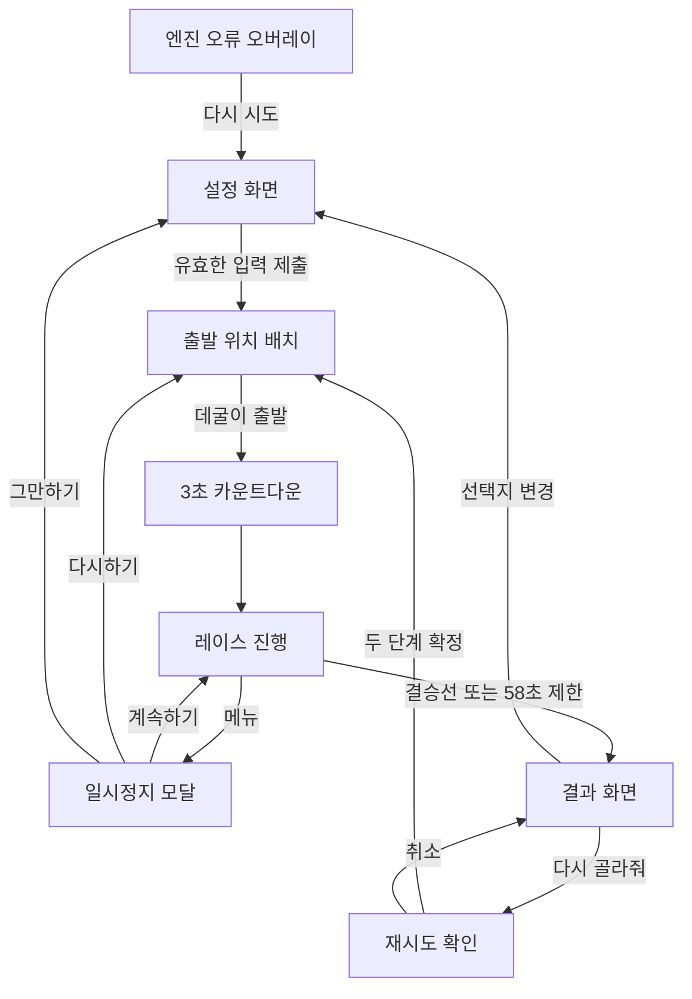

# 정보구조

[README로 돌아가기](../README.md) · [기능 명세](functional-specification.md) · [아키텍처](architecture.md)

## 개요

데굴픽은 URL 라우터와 계정 역할이 없는 단일 페이지 앱입니다. [`App.tsx`](../src/App.tsx)의 `activeScreen`과 `placementMode`가 화면 전환을 소유하며, 모든 사용자는 같은 영역에 접근합니다.

## 화면 구조

| 화면/상태 | 식별자 | 진입 조건 | 주요 행동 | 다음 화면 | 상태 |
| --- | --- | --- | --- | --- | --- |
| 설정 | `setup` | 앱 시작 또는 선택지 변경 | 고민·선택지·캐릭터·환경 설정 | 배치 | 구현 완료 |
| 배치 | `playing` + `placementMode` | 유효한 설정 제출 | 캐릭터 위치 이동, 출발 | 레이스 | 구현 완료 |
| 카운트다운 | `playing` | 출발 버튼 선택 | 3-2-1 확인 | 레이스 | 구현 완료 |
| 레이스 | `playing` | 카운트다운 완료 | 진행 관전, 메뉴 열기 | 일시정지 또는 결과 | 구현 완료 |
| 일시정지 모달 | `paused` | HUD 메뉴 선택 | 계속, 다시하기, 그만하기 | 레이스·배치·설정 | 구현 완료 |
| 결과 | `result` | 결승선 통과 또는 시간 제한 | 순위 확인, 선택지 변경, 다시 하기 | 설정 또는 재시도 확인 | 구현 완료 |
| 재시도 확인 | 결과 내부 상태 | 다시 골라줘 선택 | 재시도 확정 또는 취소 | 배치 또는 결과 | 구현 완료 |
| 엔진 오류 | 오류 오버레이 | 엔진/테마 초기화 실패 | 페이지 새로고침 | 앱 초기화 | 구현 완료 |

## 상태 전환

## 공통 레이어

- 게임 캔버스는 설정·배치·레이스·결과 상태에서 동일한 엔진 인스턴스를 유지하며 오버레이 뒤에 렌더링됩니다.
- HUD는 항상 마운트되지만 설정 및 결과 오버레이가 그 위를 덮습니다.
- 실시간 순위는 실제 레이스 중이고 배치 상태가 아닐 때만 표시됩니다.
- 인증 전후나 관리자/일반 사용자 분기는 없습니다.

## 주요 사용자 여정

### 첫 선택

설정 입력 → 캐릭터 선택 → 시작 위치 배치 → 카운트다운 → 레이스 관전 → 우승과 순위 확인

### 같은 선택지로 다시 하기

결과 → 다시 골라줘 → 1차 확인 → 2차 확인 → 새 시작 위치 배치 → 레이스

### 진행 중 변경

레이스 → 일시정지 → 그만하기 → 기존 입력이 남은 설정 화면 → 내용 수정 후 재출발

## 제한과 근거

- 별도 URL 경로나 deep link는 없습니다. 진입점은 [`src/main.tsx`](../src/main.tsx) 하나입니다.
- 브라우저 뒤로가기 기반 화면 전환은 없고, 앱인토스 설정에서 WebView의 뒤로가기 제스처도 비활성화합니다([`granite.config.ts`](../granite.config.ts)).
- 화면 설계 근거는 [`App.tsx`](../src/App.tsx)와 각 [`components`](../src/components) 구현이며, `docs/superpowers`의 과거 설계 문서는 현재 구조 판정의 우선 근거로 사용하지 않았습니다.
